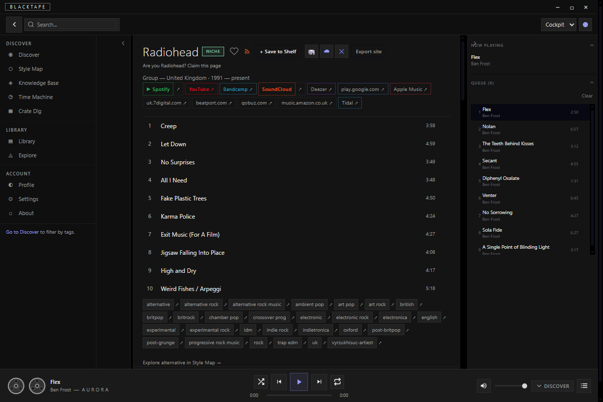
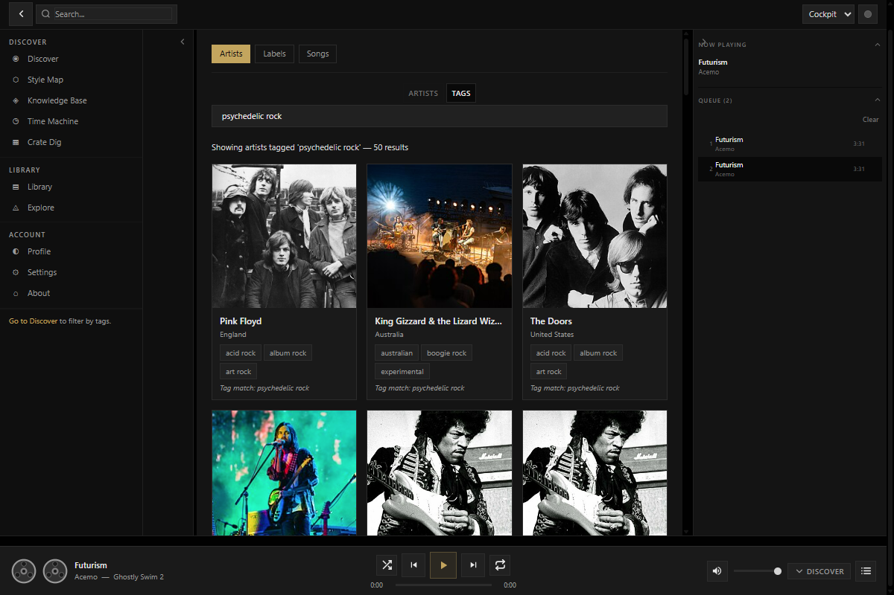
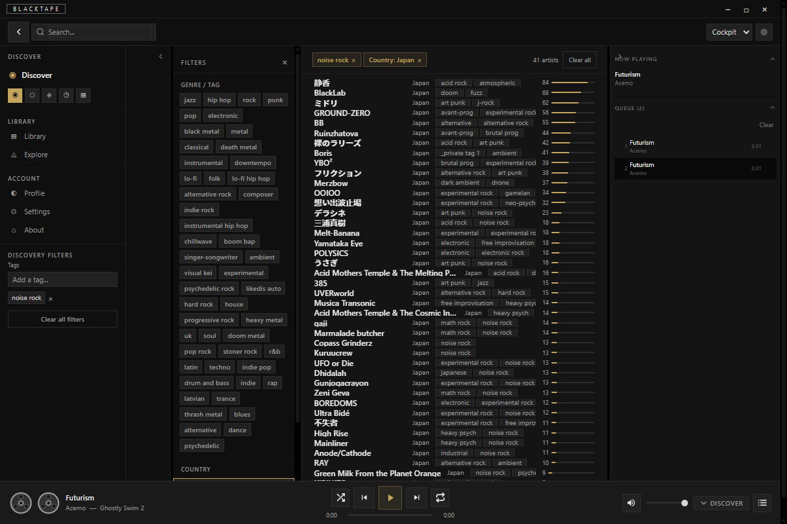
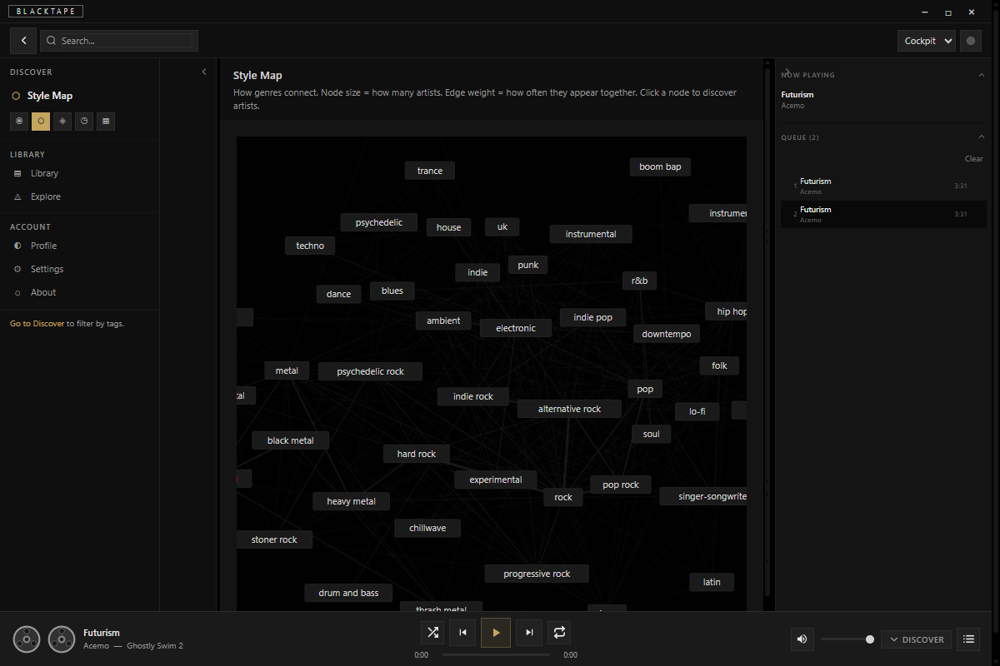
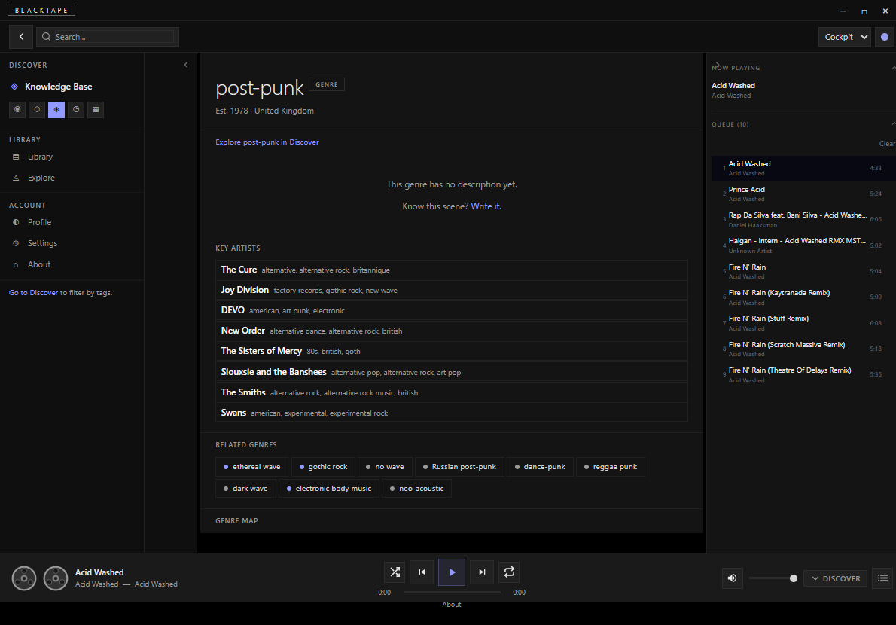
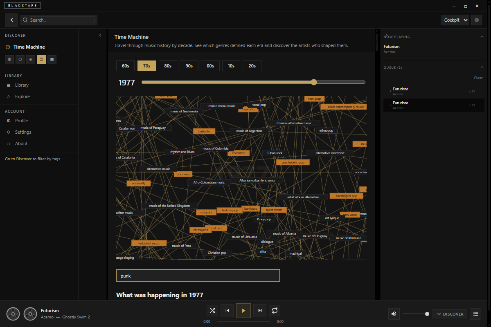
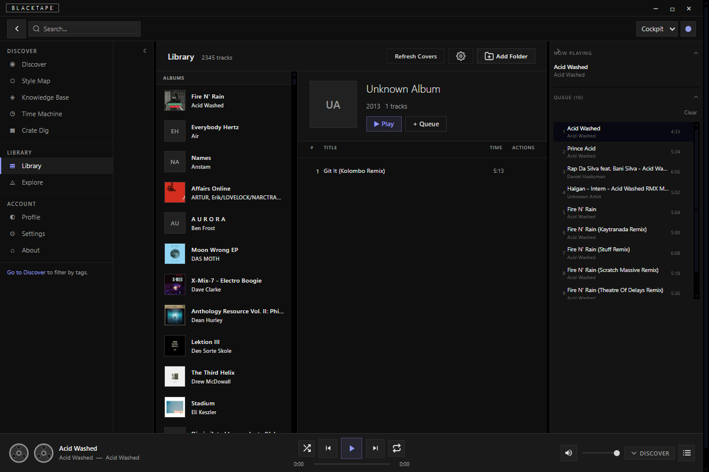

# BlackTape

> Dig deeper.

**Work in progress.** Early access — bugs are expected. Report them via the [feedback form](https://blacktape.org/about#feedback) or open an [issue](https://github.com/AllTheMachines/BlackTape/issues).

A discovery engine, not a streaming platform. BlackTape indexes everything from open databases, embeds players from wherever music already lives, and gets out of the way.

The core inversion: niche artists surface first, not last. The less well-known you are, the more BlackTape rewards your discoverability. Search by tag combination and an underground artist with three matching tags ranks above a major act with fifty. That's the whole premise.

---

## Screenshots

| | |
|---|---|
|  |  |
| **Artist page** — streaming links, tags, discography, queue | **Search** — tag-based results with artist cards |
|  |  |
| **Discover** — filter by tag, country, uniqueness score | **Style Map** — interactive genre connection graph |
|  |  |
| **Knowledge Base** — genre pages with key artists and related genres | **Time Machine** — see which genres defined each era |
|  | |
| **Local Library** — scan your own files, play alongside the global index | |

---

## The Problem

Streaming has solved access and broken discovery. Every recording ever made is theoretically available — yet the algorithms that decide what you hear next are built to maximise session length, not to help you find something you've never encountered.

The underground isn't hidden because it doesn't exist. It's hidden because it doesn't perform.

The data to fix this already exists in the open — MusicBrainz (2.6M artists, CC0), Discogs (18M+ releases), and the music itself lives on Bandcamp, SoundCloud, YouTube, and artist websites. BlackTape assembles the open pieces into a coherent discovery experience.

---

## What It Does

- **Search 2.6 million artists** indexed on day one from MusicBrainz (CC0, public domain)
- **Play your local music** — scan your folders, read metadata, full library browser
- **Discover by atomic tags** — not "electronic" but "dark ambient / granular synthesis / Berlin school"
- **Embed players** from wherever music already lives — Bandcamp, Spotify, SoundCloud, YouTube. No audio is hosted by us.
- **Explore genres and scenes** — a living knowledge base of genres, movements, and geographic scenes with interactive maps
- **Crate dig** — random serendipitous browsing through a filtered stack, like flipping records at a shop
- **Time Machine** — browse what came out in any year, watch how genres evolved
- **AI-powered discovery** — natural language exploration, generated artist summaries, similarity search. Open models run locally; your data stays on your machine.
- **Import your library** from Spotify, Last.fm, Apple Music, or CSV
- **Export playlists** as M3U8 or Traktor NML, with optional file copy

### Uniqueness Is the Discovery Mechanism

The more niche you are, the more discoverable you become. If you're tagged "electronic" you're one of 500,000. If you're tagged "dark ambient / granular synthesis / field recordings from abandoned factories" you're one of 12. The system naturally rewards artists who carve their own niche and demotes generic content without having to ban anything.

### What It's Not

- A streaming service — no audio hosting, ever
- A payment processor — links to where music is sold
- A blockchain or token
- A company that can be shut down — open source always

---

## Installation

### Prerequisites

- Windows 10/11 (current release target)
- [WebView2 Runtime](https://developer.microsoft.com/en-us/microsoft-edge/webview2/) — usually already installed on Windows 11

### Steps

1. Download the latest installer from the [Releases](https://github.com/AllTheMachines/BlackTape/releases) page
2. Run the installer
3. On first launch, the **Setup Wizard** guides you through:
   - **Database** — Download `mercury.db.gz` from the releases page, decompress it, and place it at the path shown in the wizard. Click "Check Again" once placed.
   - **AI Models** — Optional. Download the generation model (~4 GB) and embedding model (~100 MB) for AI bios and similarity search. Click "Skip for now" to proceed without them.
4. Done — BlackTape is ready

**Re-running the wizard:** Settings → About → "Reset setup"

### Security

API keys (for remote AI providers) and Spotify OAuth tokens are stored in the OS credential store (Windows Credential Manager). They are never written to plain text files.

---

## Architecture

### Your Machine Is the Platform

```
DESKTOP (the product)
  Tauri 2.0 app
  SQLite on your disk              → mercury.db   (2.8M artists, discovery index)
  Local music playback             → library.db   (your scanned files)
  AI models on client side         → taste.db     (AI settings, taste profile)
  Full power, offline capable
  Unkillable
```

**User data lives locally.** Favorites, collections, taste profiles, local music library — all in SQLite on your machine. No central server. No account required. No data to surrender.

**Discovery data comes from the open internet.** MusicBrainz, Wikipedia, Cover Art Archive, SoundCloud, YouTube — fetched live, cached locally. BlackTape is an aggregation layer, not a host.

**The database is distributed.** The entire search index is a single SQLite file (~100-200MB compressed). Downloadable. Torrentable. Every user has the whole thing on their machine. Domain seized? Cloudflare bans us? Doesn't matter — the data lives on thousands of user machines.

### Tech Stack

| Layer | Technology |
|-------|-----------|
| Desktop shell | Tauri 2.0 (Rust + WebView2) |
| UI | SvelteKit (Svelte 5, TypeScript) — static SPA |
| Search index | SQLite + FTS5 (local, via tauri-plugin-sql) |
| Local audio | HTML5 Audio via Tauri `asset://` protocol |
| AI | llama-server sidecar — Qwen2.5 (generation) + Nomic (embeddings) |
| Data pipeline | Node.js scripts — processes MusicBrainz/Discogs dumps locally |
| Secrets | Windows Credential Manager via `keyring` crate |
| Updates | tauri-plugin-updater → GitHub Releases |

### Data Sources

| Source | Data | License |
|--------|------|---------|
| MusicBrainz | 2.6M artists, 4.7M releases, 35M recordings | CC0 (public domain) |
| Discogs | 18M+ releases, labels, credits | Free data dumps |
| Wikidata | Genre relationships, scene/movement data, geocoordinates | CC0 |
| Wikipedia | Artist bios (fetched live) | CC-BY-SA |
| Cover Art Archive | Release artwork (fetched live) | Various open licenses |

---

## Development

Requires Node.js 20+, Rust (stable), and the [Tauri prerequisites](https://tauri.app/start/prerequisites/).

```bash
git clone https://github.com/AllTheMachines/BlackTape.git
cd BlackTape
npm install
npm run tauri dev    # Rust + frontend
```

```bash
npm run dev      # Frontend only (no Tauri)
npm run build    # Production build
npm run check    # TypeScript + Svelte checks
```

See [ARCHITECTURE.md](ARCHITECTURE.md) for a full breakdown of how everything connects.

---

## Principles

- **No audio hosting.** Ever. Audio lives on the artist's own infrastructure.
- **No tracking, no ads, no algorithmic manipulation.** This is a discovery tool, not a retention tool.
- **No vanity metrics.** No follower counts. No like counts. No play counts. The music is the signal.
- **No paid tiers.** No premium features. No "pro" anything. Everyone gets the same thing.
- **Open source always.** No decisions that lock this into a proprietary ecosystem.
- **The name lives in one place.** `src/lib/config.ts` — change it once, it propagates everywhere.

---

## Who's Building This

Steve — musician, label co-founder (Vakant, Kwik Snax), 30 years of electronic music. Built from lived frustration, not market analysis.

The build is streamed live on YouTube. The [BUILD-LOG.md](BUILD-LOG.md) is a documentary record of every decision, dead end, and breakthrough.

---

## Contributing

The codebase is open. Read [ARCHITECTURE.md](ARCHITECTURE.md) to understand how everything connects before diving in.

---

## License

Open source. License TBD.
